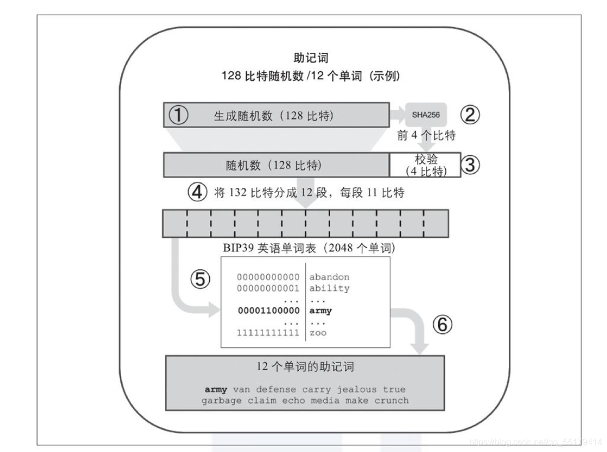

## 什么是区块链钱包   
&emsp;区块链钱包是加密货币应用中必不可少的一部分，也是加密基础设施中最基础的一部分，区块链钱包的存在使得区块链收发资金成为可能。区块链钱包同时也是web3.0的一个重要入口，事实上，**web3的绝大多数应用，必须要连接区块链钱包才能进一步使用**
#### 根据钱包的存储方式划分
&emsp;根据用户是否掌握了私钥，可分为**中心化钱包** 和 **去中心化钱包**
>>存储方式是指存在哪，只有用户持有私钥且导入钱包后，私钥存在用户设备上后才叫**中心化钱包**，中心化钱包的数据依赖于服务商自己的账本，交易所就是一个典型的中心化钱包，在交易所内完成的交易，就是交易所在自己的账本上增加记录，这个过程，没有发生在链上。 
&emsp;而无私钥，或者私钥存储在服务商的服务器里，则就是**去中心化钱包**，
#### 根据是否接触网络
&emsp;钱包是否联网可分为**冷钱包** 和 **热钱包**
>> 常见的热钱包指的是桌面钱包: 如 **比特币核心钱包**、**Geth**, 手机钱包，**imToken**、**TpToken**等，以及网页钱包, 如 **metamask** ,而冷钱包指的是硬件钱包，无需联网即可使用，冷钱包外形像U盘。
#### 根据去中心化程度
&emsp;可将钱包分为**全节点钱包**、**轻节点钱包**、**中心化钱包**
>>全节点钱包：完整储存了区块链一切买卖数据的区块链钱包，一般作为官方钱包与节点客户端运用，能够追溯数字财产的来历，验证数字财产的真实性、验证区块链上的买卖是否完成等，由于全节点钱包存储的数据巨大，且数据需要和区块链同步，因此实用性依赖于具体场景。
轻节点钱包：没有彻底存储区块链买卖节点的数据钱包，由于数据不完整，只保留了区块链钱包的基本功能，即接入功能和买卖验证功能，轻钱包所有的功能都是为了支持交易的成功进行，市面上常见的app钱包都是轻钱包：**AToken**、**myToken**、**Kcash**等.
#### 根据是否支持多币种
&emsp;钱包是否支持多币种可分为 **单币种钱包** 和 **多币种钱包**
>> 单一币种钱包：只为单一区块链资产服务的钱包，也叫主链钱包，一般由项目方或社区开发。
多币种钱包：支持多个区块链的数字资产，
全币种钱包：支持所有区块链资产，目前全币种钱包很难存在，这意味该钱包需要支持所有类型区块链协议。
市场上的多币种钱包已成为主流。
**imToken** 是依据单ETH主链的多币种钱包，仅支持以ETH协议开发的token。
**EOSToken** 是以EOS主链的钱包, 仅支持EOS协议开发.
#### 根据私钥签名方法可分为单签名钱包和多签名钱包
>> 单签名钱包，由单个私钥签名的钱包
多签名钱包，需要不同私钥签名进行使用的钱包，一般用于共同管理账户，
大多数区块链钱包App都是单签名钱包，Gnosis则是多签名钱包。

### 区块链钱包的设计原理
- 私钥、公钥和地址产生的方法
>&emsp; 1.比特币私钥其实是使用SHA-256生成的32字节（256位）的随机数，有效私钥的范围则取决于比特币使用的secp256k1 椭圆曲线数字签名标准。
&emsp; 2.在私钥的前面加上版本号，后面添加压缩标志和附加校验码，（所谓附加校验码，就是对私钥经过2次SHA-256运算，取两次哈希结果的前四字节），然后再对其进行Base58编码，就可以得到我们常见的WIF（Wallet import Format)格式的私钥。
&emsp; 3.私钥经过椭圆曲线乘法运算，可以得到公钥。公钥是椭圆曲线上的点，并具有x和y坐标。公钥有两种形式：压缩的与非压缩的。早期比特币均使用非压缩公钥，现在大部分客户端默认使用压缩公钥。
&emsp; 从私钥推导出公钥、再从公钥推导出公钥哈希都是单向的，也就是**采用不可逆算法**

**_椭圆曲线算法_**
>>&emsp; 4.公钥产生后，将公钥通过SHA256哈希算法处理得到32字节的哈希值；后对得到的哈希值通过RIPEMD-160算法来得到20字节的哈希值 ——Hash160
&emsp; 5.把版本号[2]+Hash160组成的21字节数组进行双次SHA256哈希运算，得到的哈希值的头4个字节作为校验和，放置21字节数组的末尾。
&emsp; 6.对组成25位数组进行Base58编码，最后得到地址。

- 使用区块链API进行远程调用
>>常见的一些钱包开源项目：
--
[_bitcoin_]
**Bitcoin Core**，官方出品
**bitcoinj**，比特币协议 Java 版
**bither**，简单安全的比特币钱包
**Electrum**，全平台轻钱包
**bread，iOS** 钱包
**Mycelium，Android** 钱包
**Copay**，同时支持 Bitcoin 和BitcoinCash
**bitcoin-wallet**，又一款 Android 钱包
**DotNetWallet**，.NET 实现的钱包
**Coinpunk**，基于浏览器的钱包
**btcwallet**，Go 实现的钱包
--
[_Ethereum/ERC20_]
**go-ethereum**，以太坊协议 Go 版
**Mist**，官方出品
**Parity**，支持 Windows、Mac、PC 的钱包
**MetaMask** chrome浏览器eth wallet插件
**MyEtherWallet**，基于浏览器的钱包
**eth-lightwallet**，轻量级 JavasSript 版本钱包
**ethaddress.org**，纸质版钱包生成器
**Neureal wallet**，支持 Windows、Mac、PC 的钱包

- 钱包设计：助记词、keystore、密码
>>私钥一般太难记忆了，使用也不方便，所以从钱包设计的角度，就为简化操作同时不丢失安全性，就出现了助记词的方法。
一般情况下，助记词由一些单词组成，只要你记住这些单词，按照顺序在钱包中输入，也能打开钱包。
根据密钥之间是否有关联，将钱包分为 *nondeterministic wallet* 和 *deterministic wallet*
*nondeterministic wallet*: 密钥对之间没有关联。
*deterministic wallet*： 密钥由一个原始的种子主密钥推导而来，常见的推导方式就是树状层级推导，(hierarchical deterministic) 简称HD
deterministic wallet 基于BIP32标准实现，通过一个共同的种子维护多对私钥，推导私钥的过程采用不可逆哈希算法，

***生成助记词***
>规定熵的位数必须是 32 的整数倍，所以熵的长度取值位128 到 256 之间取 32 的整数倍的值，分别为 128, 160, 192, 224, 256；
校验和的长度为熵的长度/32 位, 所以校验和长度可为 4，5，6，7，8 位；
助记词库有 2048 个词，用 11 位可全部定位词库中所有的词，作为词的索引，故一个词用 11 位表示，助记词的个数可为 (熵+校验和)/11，值为 12，15，18，21，24
助记词规则:
1.生成一个长度为 128~256 位(bits)的随机序列(熵)；
2.取熵哈希后的前n位作为校验和(n= 熵长度/32)；
3.随机序列+校验和；
4.把步骤3得到的结果每 11位切割；
5.步骤4得到的每11位字节匹配词库的一个词；
6.步骤5得到的结果就是助记词串;

7.助记词句子作为密码；
8."mnemonic" + passphrase 作为盐；
9.2048 作为重复计算的次数+HMAC-SHA512 作为随机算法,最终得到BIP32 种子，512 位(64 字节)是期望得到的密钥长度；

除了助记词之外，钱包还会设计一个密码，作为用户常用的登录方式，
keystore：Keystore也是私钥经过加密过后的一个文件，需要你自己设置的密码才能打开文件。这样的好处是就算keystore文件被盗，只要你额外设置的密码够长够随机，那么短时间内私钥也不会泄露，有充足的时间转移地址里面的加密货币到其他地址。Keystore会存储在使用的设备里，这样每次登陆只用输入相应密码即可。

***总结***
>钱包助记词生成了种子（Seed），种子（Seed）生成了私钥，私钥推导出公钥，公钥节选部分成了钱包地址。同时钱包提供了keystore，他也是私钥加密后的文件，可以配合正常的密码使用，便捷了用户的钱包使用

[*私钥重复问题*]
私钥产生的机制就决定了会有重复的可能。
>&emsp; 私钥有32个字节，一个字节有8位，所以私钥总数是2^(8*32)=2^256个≈10^77个
假设宇宙有一亿个星系，
每个星系有一亿颗恒星，
每颗恒星有一亿颗人造卫星，
每颗人造卫星上有一亿台超级计算机，
每台超级计算机有一亿个CPU，
每个CPU每秒可以穷举一亿个私钥。
假设有一亿个私钥的地址上有BTC（每个地址平均0.21BTC），那么，多久可能穷举出一个有币的私钥为：
10^77（私钥总数）/10^8（有币私钥）/10^8（星系）/10^8（恒星）/10^8（卫星）/10^8（超级计算机）/10^8（CPU）/10^8（每秒穷举）=10^21秒。
10^21秒/3600秒/24小时/365天=317098亿年
随着时间的累积，再加上还会有其他的公链出现，如果使用同样的私钥生成地址的规则，概率再小也会有几率出现重复的情况。但是穷举法的代价已经远远超过了所获利，因此可以理解私钥是唯一的。

#### 理解钱包的作用
>完成一次交易之后，钱包里没有币，也没有NFT，钱包里保存的是自己的区块链地址和对这个地址的操作权限，这些我们交易得到的币、NFT、或者其他什么加密资产是被记录在了各个网络上的对应的区块链中。
可以说，钱包是区块链的遥控器，创建钱包时，用助记词算出私钥，私钥和公钥配对出现，公钥算出地址，地址就是你在区块链中的账号，助记词可以重新算出私钥，可重置钱包，同时钱包生成的keystore也可以解密后获得私钥，用于重置钱包。
私钥的作用是获得对地址的操作权限。钱包地址可以看作区块链上的一个节点。
发起交易，是通过私钥授权，对地址对应的数据区块进行修改。
